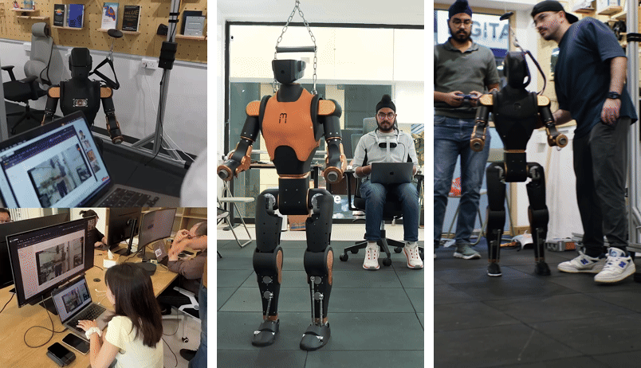
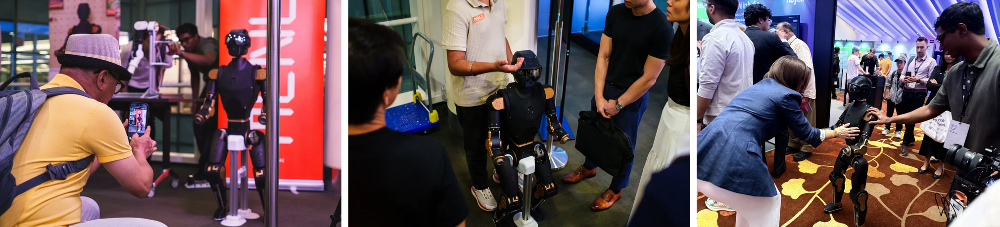

# Asimov

Asimov is an open reference humanoid by [Menlo Research](https://menlo.ai), designed to bootstrap a global ecosystem across manufacturing, servicing and supply chain.

&nbsp;
&nbsp;
&nbsp;

## Our goal: SOTA humanoid by Asimov 5

- **[Asimov 0](https://manual.asimov.inc/v0)** (open sourced 27 Jan 2026): bipedal legs built for those who want to understand locomotion from the ground up.
- **[Asimov 1](https://manual.asimov.inc/v1)** (open sourced 27 Apr 2026): the full body humanoid — fully yours to assemble, customize and program.
- **Asimov 2**: coming soon

<!-- TODO: blueprint exploded-view image goes here (Mimi to provide) -->

## Get involved

Asimov gets better the more people build alongside us.

- **[Join the community](https://discord.gg/zHS5ejhZUE)**: Come hang out, ask questions, show off what you're building
- **[Partner with us](https://tally.so/r/J9O5BJ)**: Manufacture Asimov with us
- **[Get in touch](https://menlo.ai/talk)**: Deploy robots, collaborate on research, or find another way to work with us

