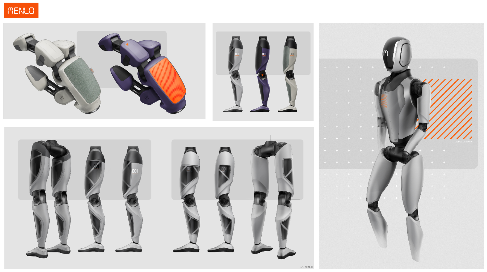

# Asimov

Asimov is an open source, bipedal humanoid robot.

## Build Manuals

* [Asimov v1](https://manual.asimov.inc/v1): Humanoid whole body (Open sourced March 31, 2026)
* [Asimov v0](https://manual.asimov.inc/v0): Humanoid legs (Open sourced Jan 2026)

## Why?

We believe enabling embodied agents at scale requires the following:

* **AI-software-hardware co-design**: for reliable sim2real transfer
* **Modular components**: customizable limbs & actuators, with the right to repair
* **Designed for manufacturing**: affordable, globally accessible parts with no shipping delays

## Contribute

* 👥 **Community**: Join the club on [Discord](https://discord.gg/zHS5ejhZUE)
* 🔬 **Collaborations**: Interested in joint research? Join the [Discord](https://discord.gg/zHS5ejhZUE)
* 💰 **Sponsor**: Become an early [Asimov Supporter](https://asimov.inc/early)
* 🏭 **Manufacturers (OEMs, SIs)**: Want to sell a humanoid? [Contact us](https://tally.so/r/J9O5BJ)
* 🛒 **Buyers**: Looking to buy a humanoid? [Contact us](https://tally.so/r/J9O5BJ)

 

Asimov is developed by [Menlo Research](https://menlo.ai). Our other "robots" in the wild include [Jan](https://jan.ai), a personal intelligence.
